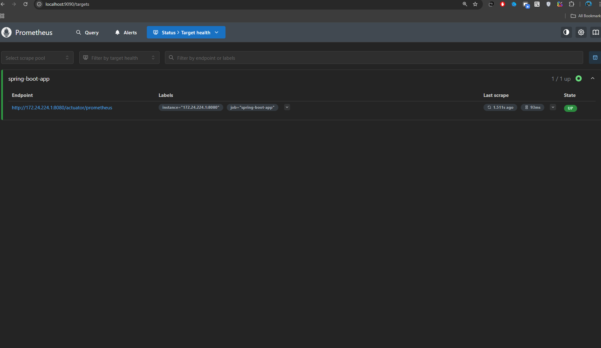
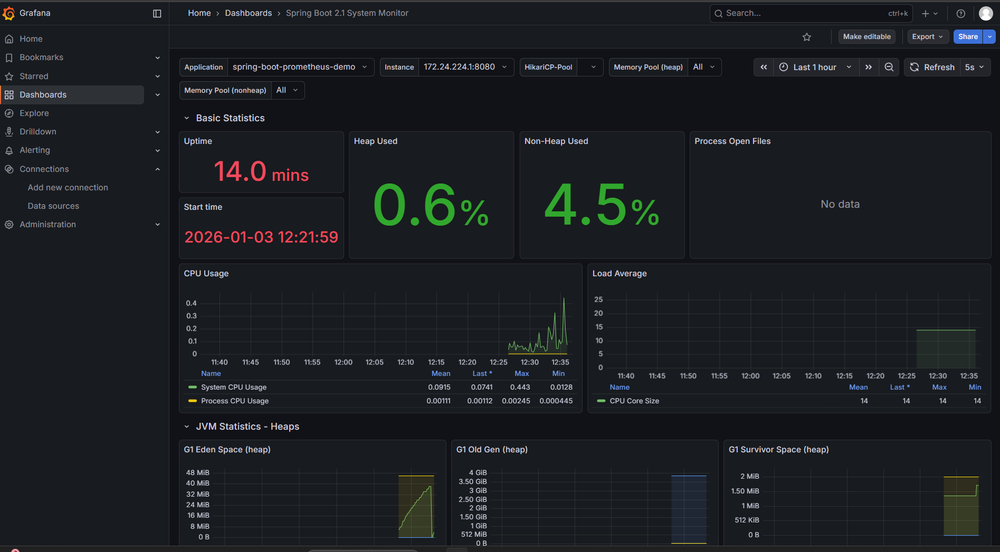

# Spring Boot with Prometheus and Grafana

### server port
- spring boot app : 8080
- prometheus      : 9090
- grafana         : 3000

## Prometheus
you can reach out prometheus for detailed infos like scrape pools and others
- url = [http://localhost:9090/targets](http://localhost:9090/targets)

## Grafana Dashboard
- url = [http://localhost:3000](http://localhost:3000)
- username = admin
- password = admin123

